# 🎬 MovieVerse

A modern **Movie Recommendation Web Application** built using **Flask**, **Neo4j Graph Database**, **HTML**, **CSS**, and **JavaScript**.

MovieVerse allows users to discover movies, explore actors, directors, genres, receive graph-based recommendations, save favorites, and watch trailers through a modern responsive interface.

---

## 🚀 Features

- 🔐 User Authentication (Login & Signup)
- 🏠 Interactive Home Page
- 🎬 Detailed Movie Information
- ❤️ Favorite Movies
- ⭐ Top Rated Movies
- 🔥 Trending Movies
- 🤖 Graph-Based Movie Recommendations
- 🎭 Browse Movies by Actor
- 🎬 Browse Movies by Director
- 🎯 Browse Movies by Genre
- 🌙 Light / Dark Theme
- ▶️ Watch Movie Trailers
- 📱 Responsive UI

---

## 🛠 Tech Stack

### Frontend
- HTML5
- CSS3
- JavaScript

### Backend
- Python
- Flask

### Database
- Neo4j Graph Database

---

## 📂 Project Structure

```text
MovieVerse/
│
├── config/
├── screenshots/
├── static/
│   ├── css/
│   ├── images/
│   └── js/
├── templates/
├── app.py
├── load_data.py
├── requirements.txt
├── README.md
├── .gitignore
└── .env
```

---

## 📸 Screenshots

### 🏠 Home (Light Mode)

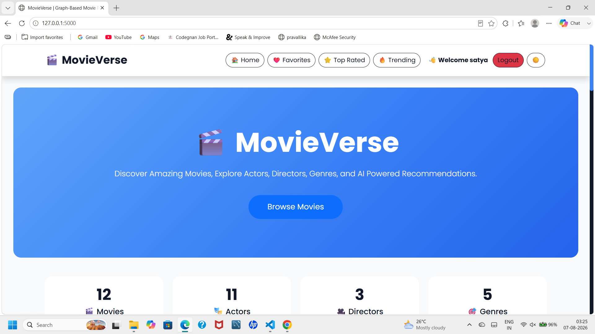

---

### 🌙 Home (Dark Mode)

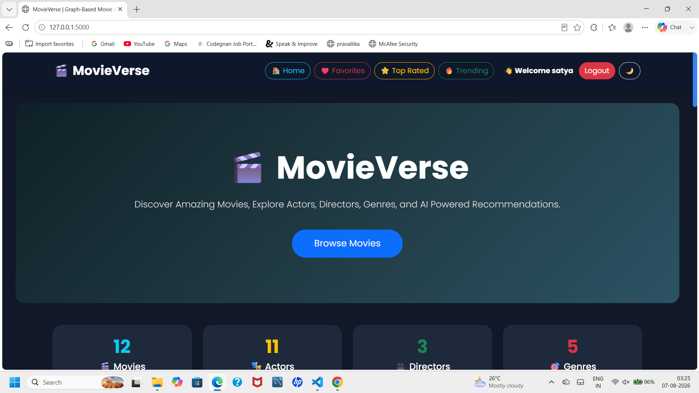

---

### 🔐 Login

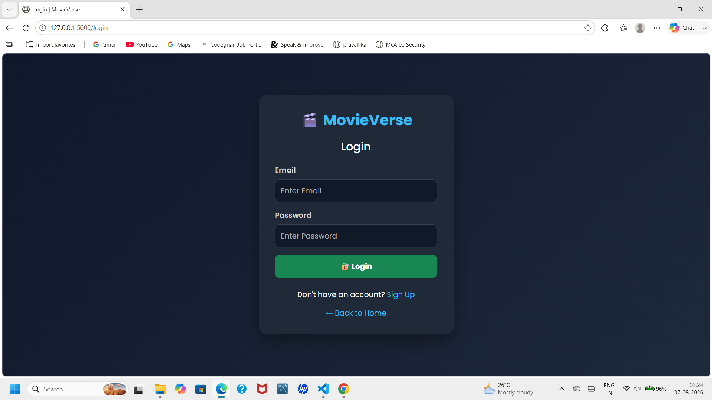

---

### 📝 Signup

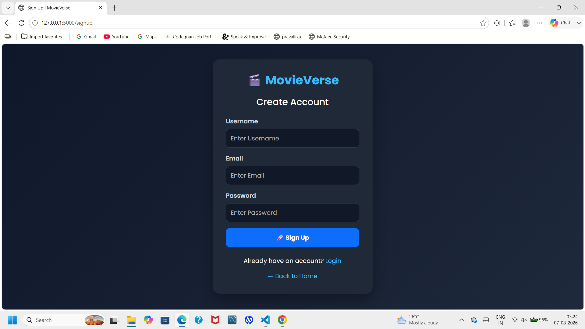

---

### 🎬 Movie Details

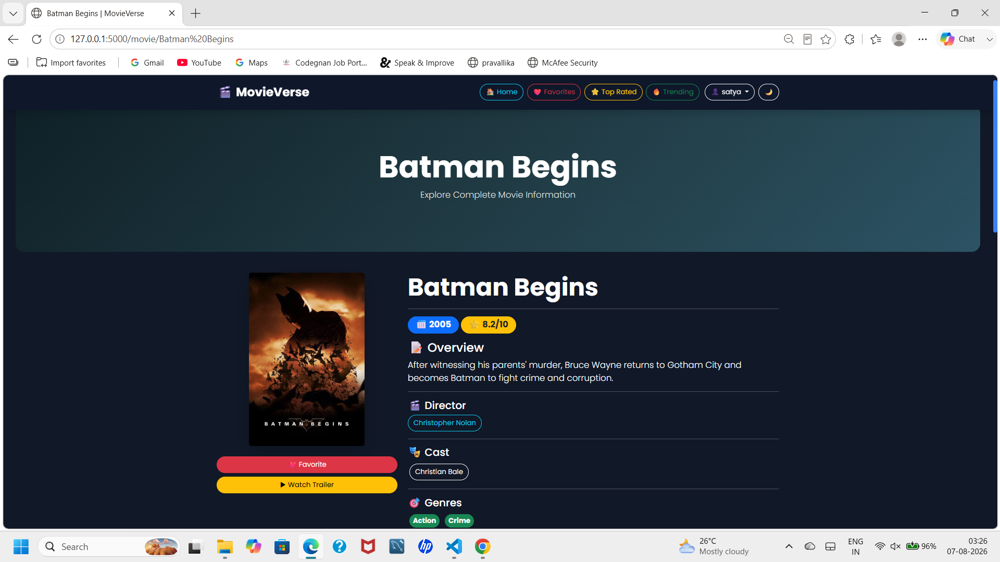

---

### 🤖 AI Recommendations

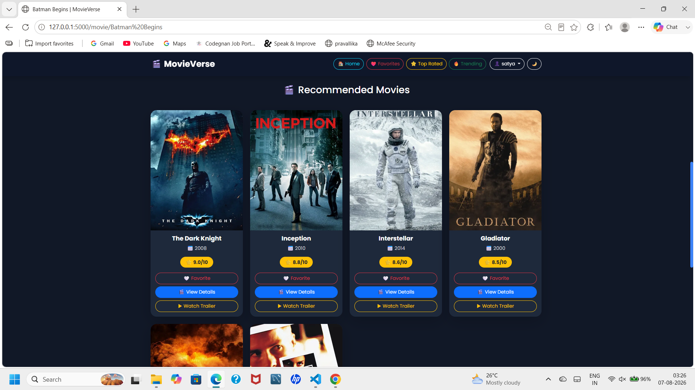

---

### ❤️ Favorites

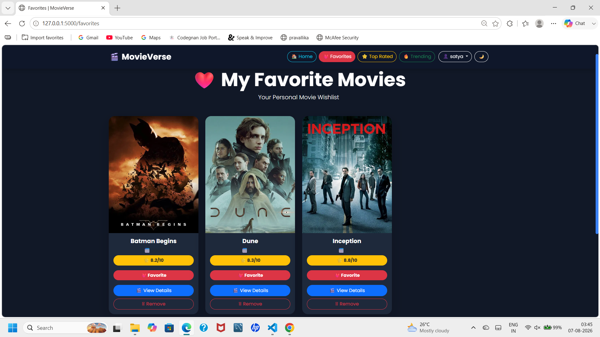

---

### ⭐ Top Rated Movies

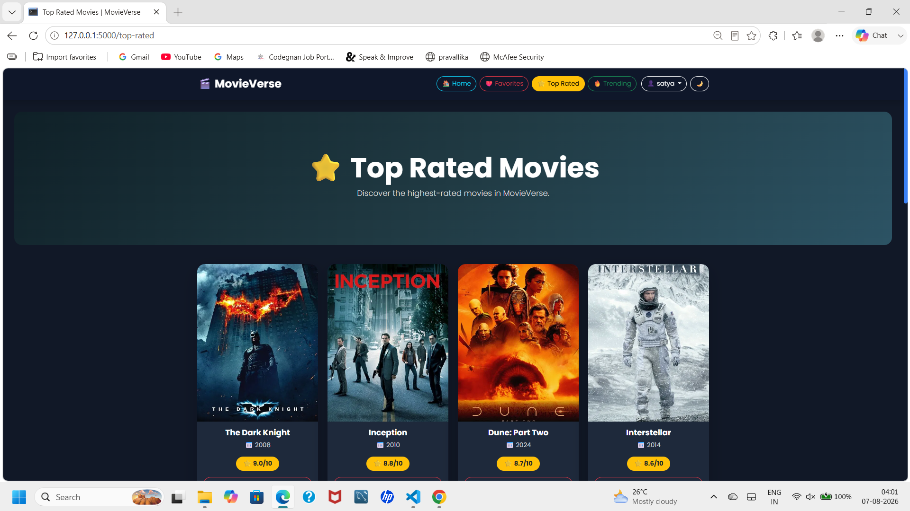

---

### 🔥 Trending Movies

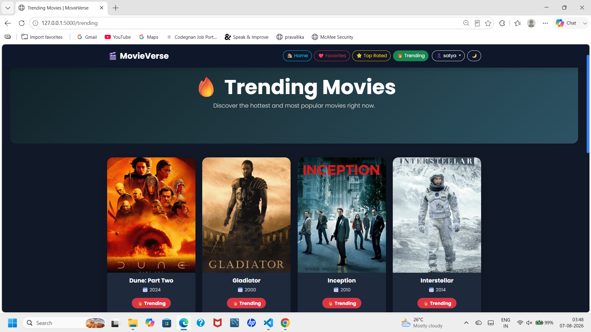

---

### 🎬 Director Page

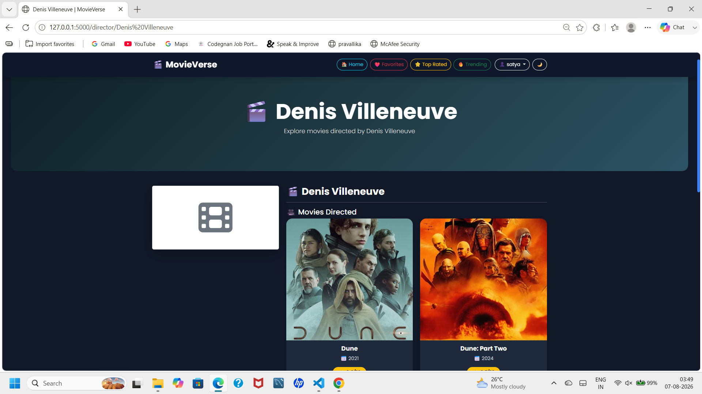

---

### 🎭 Actor Page

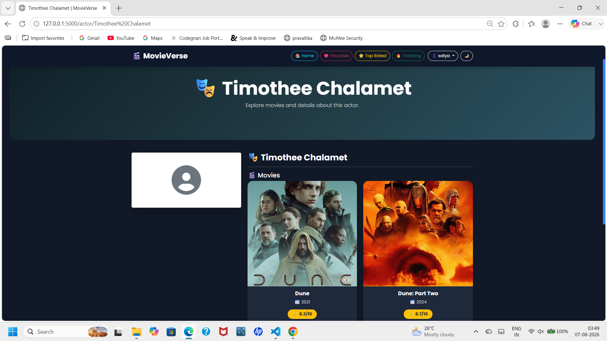

---

### 🎯 Sci-Fi Genre

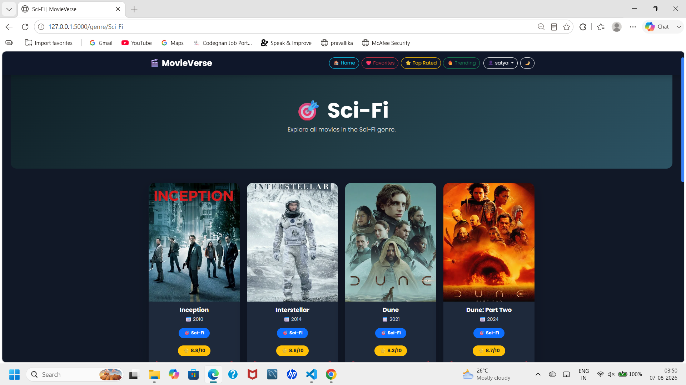

---

### 🎯 Adventure Genre

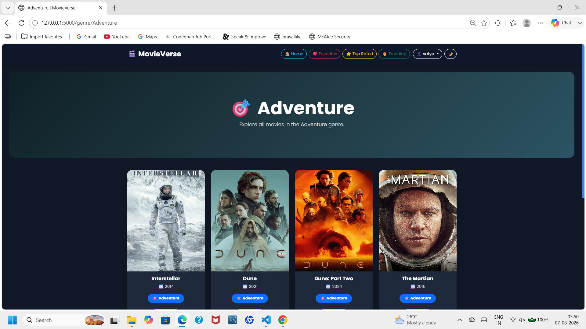

---

### 🎯 Crime Genre

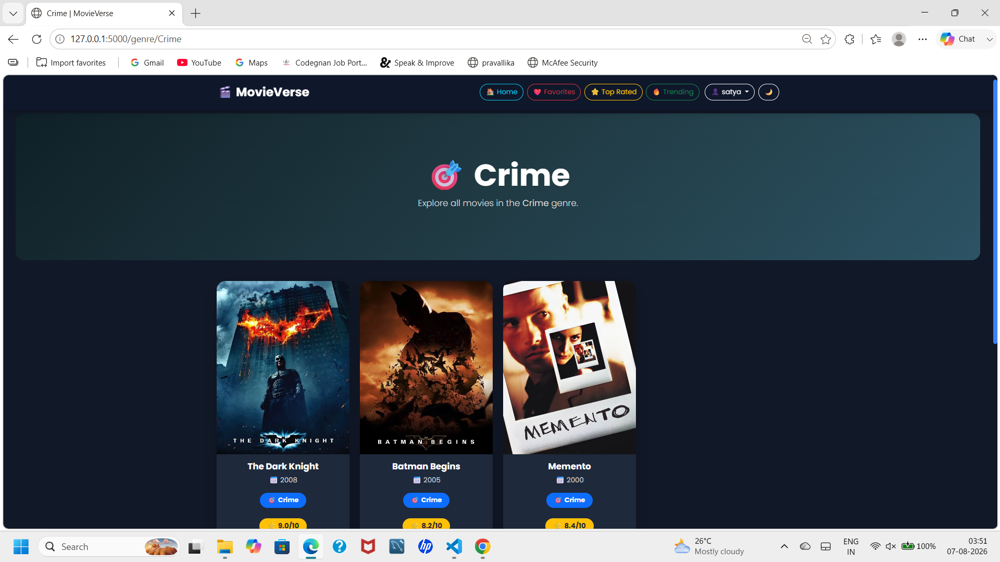

---

## ⚙️ Installation

### Clone Repository

```bash
git clone https://github.com/yourusername/MovieVerse.git
```

### Go to Project

```bash
cd MovieVerse
```

### Install Dependencies

```bash
pip install -r requirements.txt
```

### Run Application

```bash
python app.py
```

Open your browser:

```
http://127.0.0.1:5000
```

---

## 💡 Future Improvements

- 🎥 TMDB API Integration
- 🤖 Machine Learning Recommendations
- 💬 Movie Reviews & Ratings
- 📱 Mobile Responsive Improvements
- ☁️ Cloud Deployment
- 🔎 Advanced Search & Filters

---

## 👨‍💻 Author

**Kudipudi Satyavani**

Python Full Stack Developer

GitHub: https://github.com/SatyaKudipudi

---

## ⭐ Support

If you like this project, consider giving it a ⭐ on GitHub.