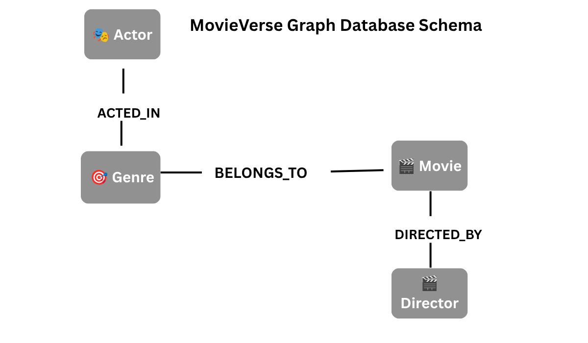

# 🎬 MovieVerse

[](https://www.python.org/)
[](https://flask.palletsprojects.com/)
[](https://neo4j.com/)
[](https://movieverse-uqgx.onrender.com)

A modern **Graph-Based Movie Recommendation Web Application** built using **Flask**, **Python**, **Neo4j (CognoDB)**, **HTML**, **CSS**, **JavaScript**, and **Bootstrap**.

MovieVerse allows users to discover movies, explore actors, directors, genres, receive graph-based recommendations, manage favorite movies, and watch movie trailers through a clean, responsive interface.

---

# 🌐 Live Demo

## 🚀 Live Website

https://movieverse-uqgx.onrender.com

## 🎥 Demo Video

https://youtu.be/-UU7r2IKw0k

## 💻 GitHub Repository

https://github.com/SatyaKudipudi/MovieVerse

---

# 🚀 Features

- 🔐 User Authentication (Signup & Login)
- 🏠 Interactive Home Page
- 🎬 Movie Details
- ❤️ Favorite Movies
- ⭐ Top Rated Movies
- 🔥 Trending Movies
- 🤖 Graph-Based Movie Recommendations
- 🎭 Browse Movies by Actor
- 🎬 Browse Movies by Director
- 🎯 Browse Movies by Genre
- 🔍 Search Movies
- ▶️ Watch Movie Trailers
- 🌙 Dark / Light Theme
- 📱 Responsive User Interface

---

# 🛠 Tech Stack

## Frontend

- HTML5
- CSS3
- JavaScript
- Bootstrap 5

## Backend

- Python
- Flask

## Database

- Neo4j Graph Database
- CognoDB Cloud

---

# 📂 Project Structure

```text
MovieVerse/
│
├── config/
│   ├── db.py
│   └── old_db.py
│
├── screenshots/
│   ├── home_light.png
│   ├── home_dark.png
│   ├── login.png
│   ├── signup.png
│   ├── movie_details.png
│   ├── recommendations.png
│   ├── favorites.png
│   ├── top_rated.png
│   ├── trending.png
│   ├── actor.png
│   ├── director.png
│   ├── sci-fi.png
│   ├── adventure.png
│   ├── crime.png
│   └── graph_schema.png
│
├── static/
│   └── css/
│       └── style.css
│
├── templates/
│   ├── index.html
│   ├── login.html
│   ├── signup.html
│   ├── movie_details.html
│   ├── favorites.html
│   ├── top_rated.html
│   ├── trending.html
│   ├── actors.html
│   ├── directors.html
│   ├── genre.html
│   └── 404.html
│
├── app.py
├── auth_db.py
├── load_data.py
├── movie_data.py
├── requirements.txt
├── README.md
├── .gitignore
└── .env
```

---

# 🤔 Why a Graph Database?

Movie recommendations depend on relationships between movies, actors, directors, and genres.

A graph database naturally models these relationships and enables efficient multi-hop traversals for recommendation queries.

MovieVerse uses Neo4j (CognoDB) to store connected data and generate recommendations based on shared actors, directors, and genres.

Example:

```
Movie
   │
ACTED_IN
   │
Actor
   │
ACTED_IN
   │
Movie
```

This approach is faster and more intuitive than traditional relational databases for recommendation systems.

---

## 🕸 Graph Database Schema

The application models relationships between movies, actors, directors, and genres using Neo4j.

<p align="center">
  
</p>

---

# 📸 Screenshots

## 🏠 Home (Light Mode)


---

## 🌙 Home (Dark Mode)


---

## 🔐 Login


---

## 📝 Signup


---

## 🎬 Movie Details


---

## 🤖 Graph Recommendations


---

## ❤️ Favorites


---

## ⭐ Top Rated Movies


---

## 🔥 Trending Movies


---

## 🎭 Actor Page


---

## 🎬 Director Page


---

## 🎯 Sci-Fi Genre


---

## 🎯 Adventure Genre


---

## 🎯 Crime Genre


---

# ⚙ Installation

## 1️⃣ Clone Repository

```bash
git clone https://github.com/SatyaKudipudi/MovieVerse.git
```

---

## 2️⃣ Move to Project Folder

```bash
cd MovieVerse
```

---

## 3️⃣ Install Dependencies

```bash
pip install -r requirements.txt
```

---

## 4️⃣ Configure Environment Variables

Create a `.env` file.

```env
DB_URI=bolt+s://your-database.databases.cognodb.com
DB_USER=cognodb
DB_PASSWORD=your_password
```

---

## 5️⃣ Load Sample Data

```bash
python load_data.py
```

---

## 6️⃣ Run Application

```bash
python app.py
```

Open your browser:

```
http://127.0.0.1:5000
```

---

# 💡 Graph Queries Used

MovieVerse uses Cypher queries to perform:

- Retrieve Movies
- Search Movies
- Movie Details
- Browse by Actor
- Browse by Director
- Browse by Genre
- Graph-Based Recommendations
- Count Movies
- Count Actors
- Count Directors
- Count Genres

Recommendations are generated using graph traversal through:

- Shared Actors
- Shared Directors
- Shared Genres

---

# 🚀 Future Improvements

- 🎥 TMDB API Integration
- ⭐ Movie Reviews & Ratings
- 🤖 AI / Machine Learning Recommendations
- 🔔 User Notifications
- ☁ Docker Deployment
- 🔎 Advanced Filters
- 📱 Progressive Web App (PWA)

---

# 👨‍💻 Author

**Kudipudi Satya**

Python Full Stack Developer

### GitHub

https://github.com/SatyaKudipudi

### Live Demo

https://movieverse-uqgx.onrender.com

### Demo Video

https://youtu.be/-UU7r2IKw0k

---

# ⭐ Support

If you found this project useful, please consider giving it a ⭐ on GitHub.

Thank you for visiting MovieVerse! 🎬
